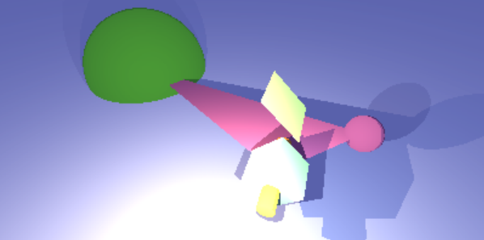

# miniRT-for-Linux

miniRT-for-Linux is a 42 Programming School project that will help us to understand how raytracing and raymarching works in terms of primitive 3D objects. In several extra features are also developed (you can move the camera with the keyboard and mouse and the box element is added).

[](https://github.com/JaeSeoKim/badge42)

## Installation

```bash
sudo apt-get install gcc make xorg libxext-dev libbsd-dev
sudo cp minilibx-linux-master/libmlx.a /usr/local/lib
sudo cp minilibx-linux-master/mlx.h /usr/local/include
make
./miniRT default.rt
```

## Default scene
This is the default.rt scene:



## How to use it

At the start of the program it will be in preview mode which is just processing 1 of 8 pixels.

If you want to make a render it will be saved in the same folder as "screenshot.bmp" (don't worry if you can't open the file, just change its permissions by executing "sudo chmod 666 sreenshot.bmp").

To control the camera angle and position use W, A, S, D and move the mouse while clicking in the window.
Use V to change between cameras and right click to reset them.

## How does it work

In case you're wondering how this thing works which is very common. I suggest you to search for "raymarching" and "sdf of an object".
I'll explain it a little bit anyway.

You have your camera in a 3D space so each pixel is a point in the space. In order to know which color you have to draw per pixel you have to send that point with the correct direction.

### Vector of the ray
This direction is determined by a vector that can be computed by simply
```c
//This is pseudocode so don't take it literal.
//We divide it by its module to normalize it because we're gonna displace it a certain distance.
v = orientation Vector
O = Origin of the camera
P = Point that represent the pixel
v = (O - P) / sqrt(O - P);
```

### Distance which displace the point
The distance you have to move the point in each loop is just the distance to the nearest object.
For example the distance from a point to a sphere is just
```c
//This is pseudocode so don't take it literal.
d = Distance to a sphere
P = Point
S = Centre of the sphere
r = Radius of the sphere
d = sqrt(P - S) - r;
```

You'll have to search a lot or be very witty to find the formulas of the asked primitives. You could also look at it in the dist/ folder but that would be cheating.

### Apply ambient light
Once we know the ray (the displaced point) has hit with an object (it's hit if d < 0.01 for example) we get the color of the hit object and do this operation.

```c
//No need to say that you have to do this for every Red, Blue and Green channel.
rgb = Final rgb color
amb = Ambient rgb light
obj = Object rgb color
rgb = amb / 255 * obj
```

### Bounce ray
To know how different light sources affect the color of the object we just have to create another ray from the hit point to the light source. Using the same tecnique before you are know able to know if this ray hits an object or reaches the light source. If it hits an object you don't have to do anything, else you have to compute how this light source affects the color.

```c
//The intensity descends with the square of the distance
rgb = Final rgb color
pnt = Point rgb color
lgt = Light rgb color
d = distance from the hit point to the light source
rgb = rgb + lgt / d^2
```
### Some reference
Here are some reference links that you might find useful.

[Ray Marching for Dummies!](https://www.youtube.com/watch?v=PGtv-dBi2wE&t=606s)

[Distance functions or SDF](https://iquilezles.org/www/articles/distfunctions/distfunctions.htm)

[SDF of a box](https://www.youtube.com/watch?v=62-pRVZuS5c&t=344s)

[Path-tracing](https://www.youtube.com/watch?v=1HYhrx9bzP8)
